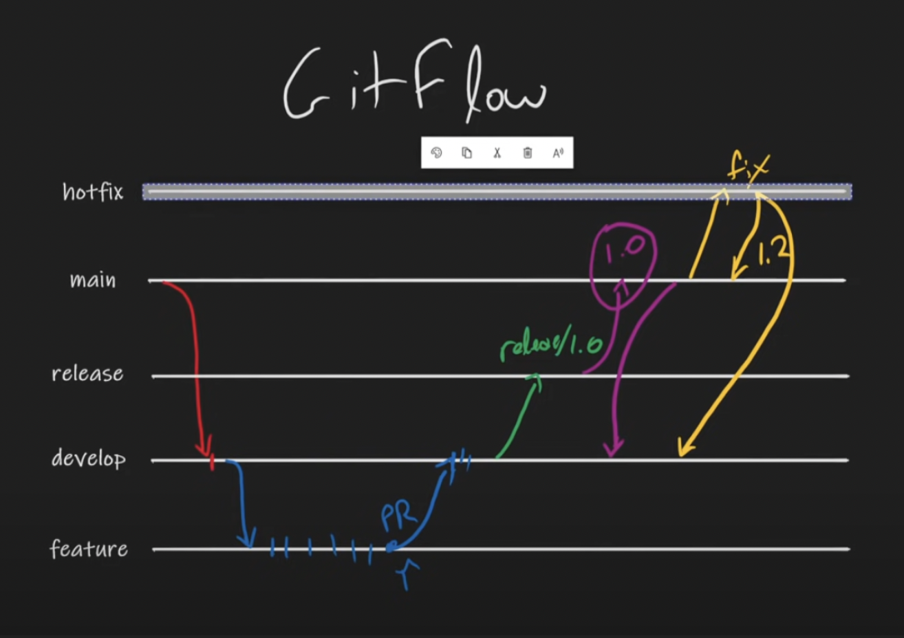

# 여행의이유-FE

 

즐거운 여행을 떠나봅시당~!

- 5기 UMC WEB DEMODAY (23.01.07)
- Development Environment : `REACT`

<br>

## 💻 WEB Developer

|               [매튜](https://github.com/dydals3440)               |               [다라](https://github.com/daindaind)               |               [징슈](https://github.com/cowboysj)               |                [빈](https://github.com/00kang)                |                [준](https://github.com/kimjunha1231)                |
| :---------------------------------------------------------------: | :--------------------------------------------------------------: | :-------------------------------------------------------------: | :-----------------------------------------------------------: | :-----------------------------------------------------------------: |
|  |  |  |  |  |
|                  <p align = "center">`기획 대기`                  |                 <p align = "center">`기획 대기`                  |                 <p align = "center">`기획 대기`                 |                <p align = "center">`기획 대기`                |                   <p align = "center">`기획 대기`                   |

## 📖 Coding Convention

### 1. Base Rule

- 기본적으로, eslint와 prettier를 적용시켜 Error와 Warning을 발생시키지 않도록 한다.

<br>

## 🙌 Git Convention

### 1. Git-flow 전략

  
\*main 대신 develop을 default 브랜치로 사용 (main은 릴리즈용)

```bash
1. 작업할 내용에 대해 Projects를 정리하고 이슈를 만든다.
2. 내 로컬에서 develop 브랜치가 최신화 되어있는지 확인한다. (develop 브랜치는 항상 pull을 받아 최신화를 시키자)
3. develop 브랜치로부터 새 브랜치를 만든다. (브랜치명은 `feature/#이슈번호`)
4. 만든 브랜치에서 작업을 한다
5. 커밋은 쪼개서 작성하며 커밋 메시지는 컨벤션을 따른다.
6. 작업할 내용을 다 끝내면 ⭐️⭐️⭐️에러가 없는지 잘 돌아가는지 (안터지는지) 확인⭐️⭐️⭐️한 후 push한다.
7. PR을 작성한 후, 리뷰(최소2개)나 수정사항을 반영해준 뒤 develop에 merge한다.
```

### 2, Issue & PR title

- 이슈를 남길 떄 아래와 같은 양식을 꼭 지킨다!

```bash
---
name: 이슈 생성 템플릿
about: 해당 이슈 생성 템플릿을 활용하여 이슈를 생성해주세요.
title: ''
labels: ''
assignees: ''

---

## 요약

<br><br>

## 작업 내용

<br><br>

## 참고 사항

<br><br>

## 관련 이슈

- Close #이슈번호

<br><br>


```

### 3. Commit Message

```bash

feat: 기능 추가, 삭제, 변경

fix: 버그 수정

docs: 문서 추가, 삭제, 변경 - 코드 수정없음

style: 코드 형식, 정렬, 주석 등의 변경
(세미콜론 추가 같은 코드 수정이 있으나, 기능에 변동 X)

refactor: 코드 리펙토링 (변수명, JS -> TS)

test: 테스트 코드 추가, 삭제, 변경 등

chore: 위에 해당하지 않는 모든 변경, eg. 빌드 스크립트 수정, 패키지 배포 설정 변경
```

<br>

### 📂 Foldering Convention

```
📦public
 ┣ 📂images
 ┣ 📜mockServiceWorker.js
 ┗ 📜vite.svg
📦src
 ┣ 📂apis
 ┃ ┣ 📂request
 ┃ ┃ ┣ 📜auth.js
 ┃ ┃ ┗ 📜travel.js
 ┃ ┗ 📜api.js
 ┣ 📂assets
 ┃ ┗ 📂fonts
 ┃ ┃ ┣ 📜NPSfont_bold.ttf
 ┃ ┃ ┣ 📜NPSfont_extrabold.ttf
 ┃ ┃ ┗ 📜NPSfont_regular.ttf
 ┣ 📂components
 ┃ ┣ 📂footer
 ┃ ┃ ┣ 📜Footer.jsx
 ┃ ┃ ┗ 📜Footer.style.js
 ┃ ┣ 📂navbar
 ┃ ┃ ┣ 📜Navbar.jsx
 ┃ ┃ ┗ 📜Navbar.style.js
 ┃ ┗ 📜index.js
 ┣ 📂constants
 ┃ ┣ 📜path.js
 ┃ ┗ 📜size.js
 ┣ 📂mocks
 ┃ ┣ 📂handlers
 ┃ ┃ ┣ 📜index.js
 ┃ ┃ ┗ 📜travel-place.js
 ┃ ┗ 📜browser.js
 ┣ 📂pages
 ┃ ┣ 📂error
 ┃ ┃ ┣ 📜ErrorPage.jsx
 ┃ ┃ ┗ 📜ErrorPage.style.js
 ┃ ┣ 📂home
 ┃ ┃ ┣ 📜Home.jsx
 ┃ ┃ ┗ 📜Home.style.js
 ┃ ┣ 📜AppLayout.jsx
 ┃ ┗ 📜index.jsx
 ┣ 📂store
 ┃ ┗ 📜useModal.js
 ┣ 📂utils
 ┃ ┗ 📜auth.js
 ┣ 📜App.jsx
 ┣ 📜index.css
 ┣ 📜main.jsx
 ┗ 📜theme.jsx

 개발 진행하면서 더 추가될 예정입니다!
```
